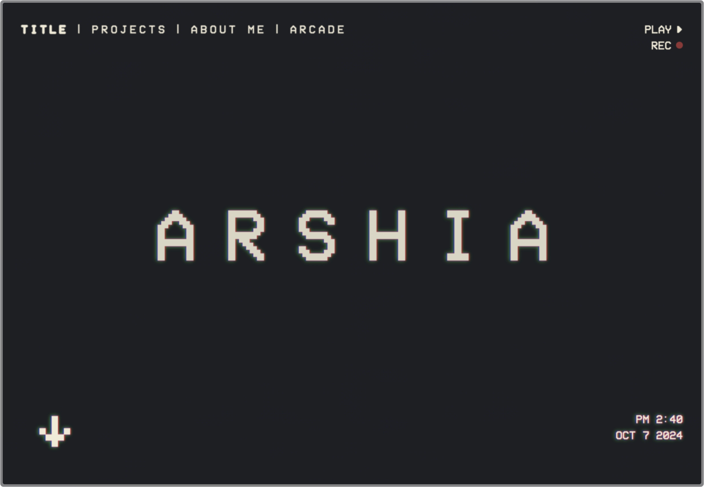
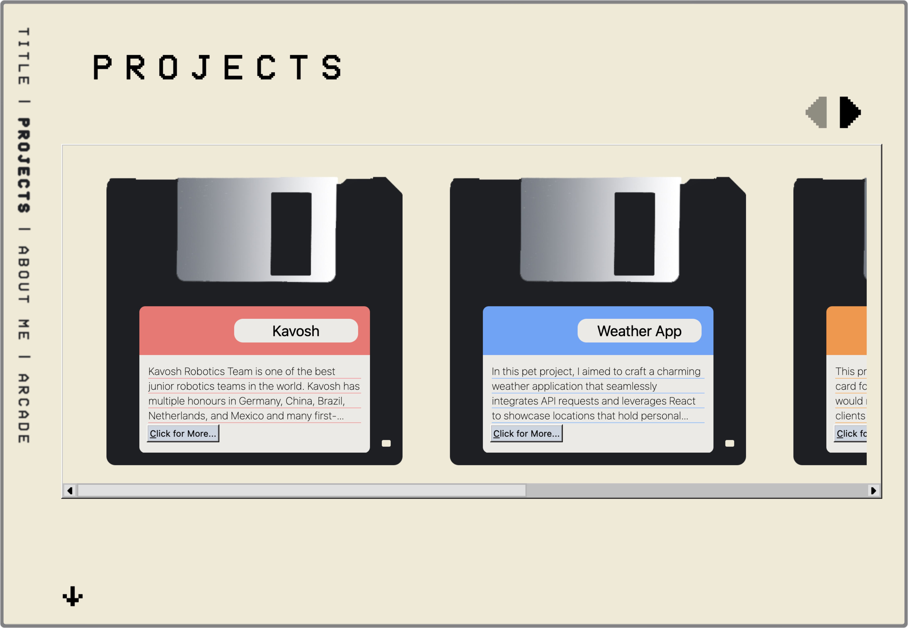
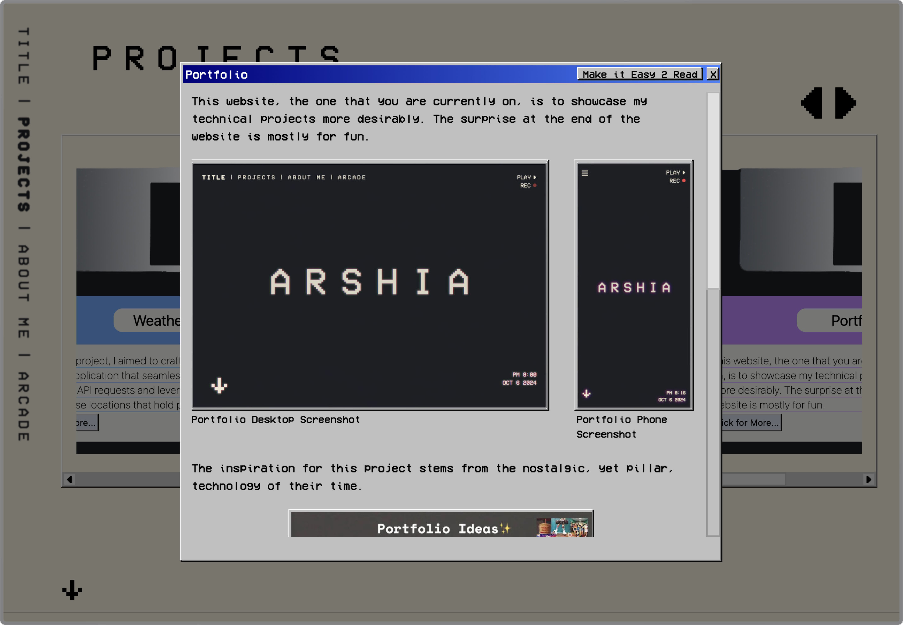
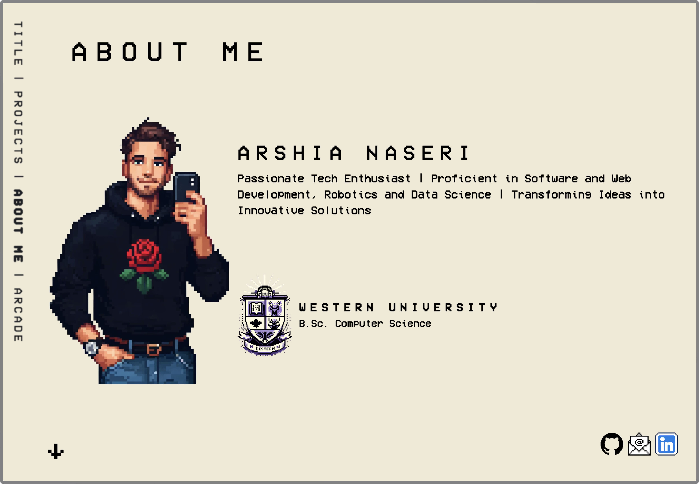
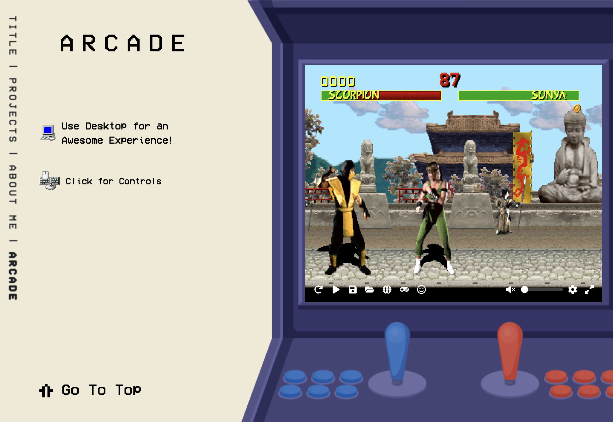
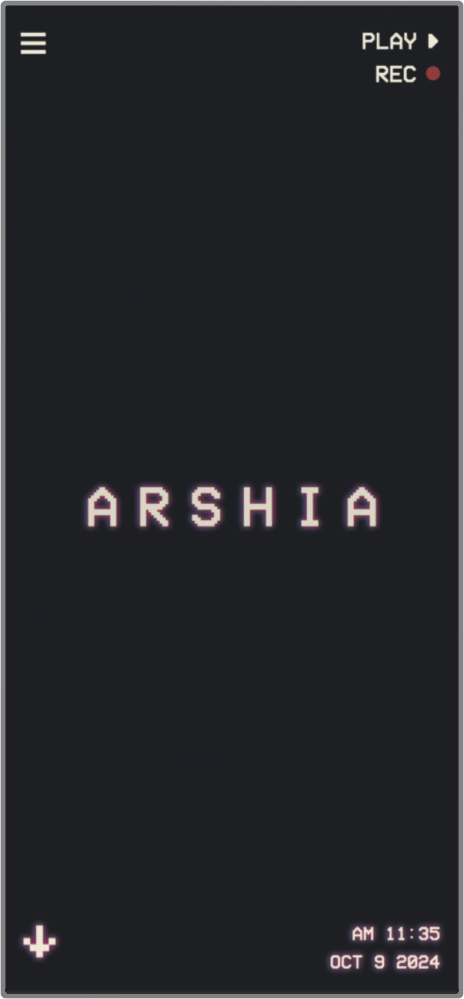
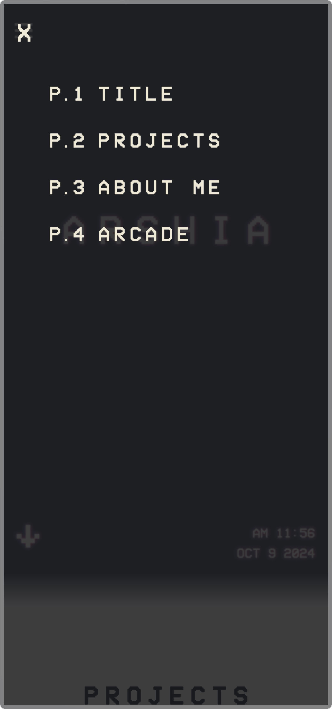
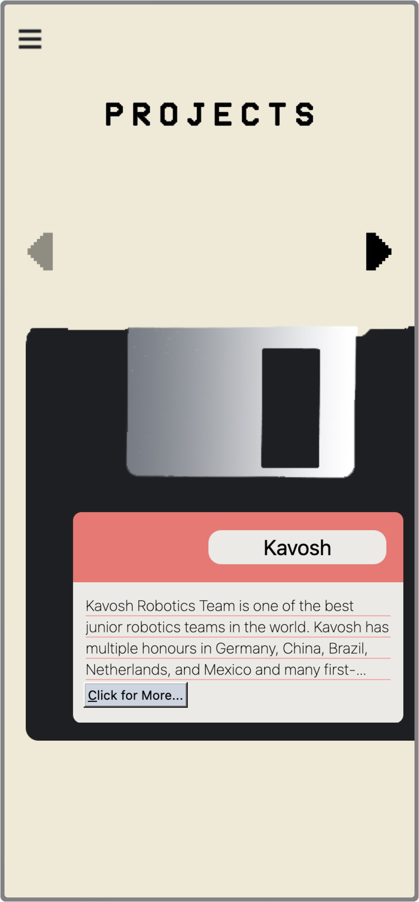
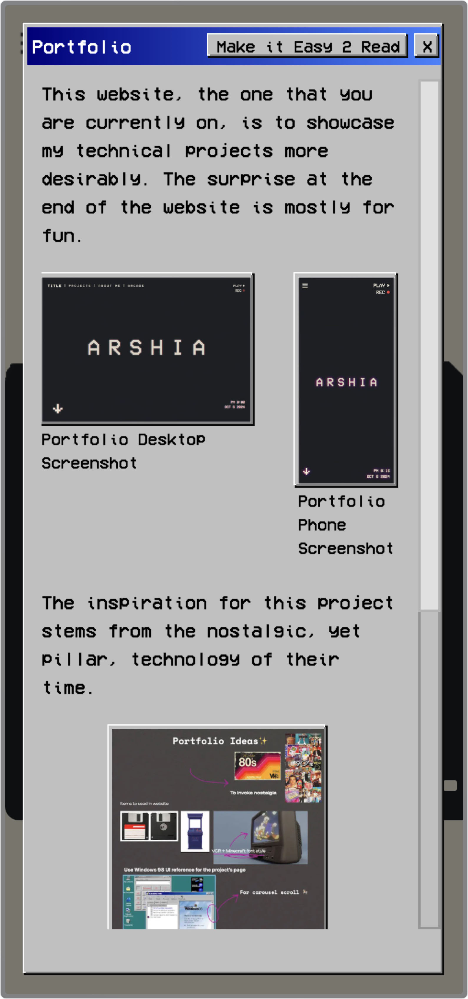
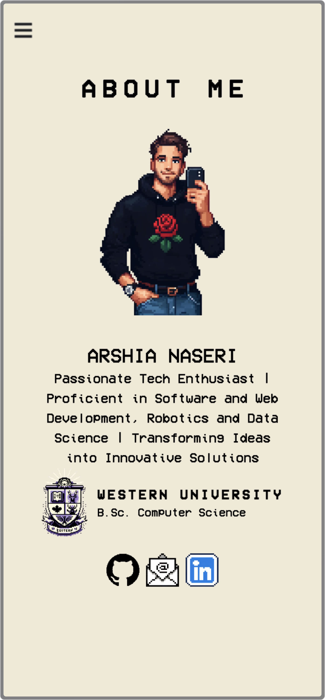

# ARSHIA's Portfolio Website

Welcome to my portfolio website! This site is designed to showcase my technical projects in a fun and engaging way. Inspired by nostalgic technology, the website combines a retro design aesthetic with modern project details and even includes an arcade section where you can play a classic **Mortal Kombat** game at the end.

## 📱 Screenshots

### Desktop View

### Mobile View

## 🌐 Website Hosting

This website is hosted on **GitHub Pages** and is set up on a custom domain: [www.arshia-naseri.com](http://www.arshia-naseri.com).

## 🛠 Features

- **Projects Section**: Detailed overview of the projects I have worked on, including my experience with **Kavosh Robotics** and my weather application project.
- **About Me**: A brief introduction of who I am, my background in **Computer Science** from **Western University**, and my passion for web development, software, robotics, and data science.
- **Arcade**: The fun part of the site—an arcade experience with **Mortal Kombat**.
- **Google Analytics**: Integrated to track website traffic and user interactions.

## 💻 Technologies Used

- **HTML/CSS**: For structuring and styling the retro-themed website.
- **JavaScript**: For interactive elements, including smooth transitions and engaging user experience.
- **React**: For project sections and handling API requests in the weather app project.
- **GitHub Pages**: For hosting the website.
- **Google Analytics**: For tracking visitor data and website traffic.

## 🎨 Design

The inspiration for the website stems from a nostalgic aesthetic, using retro gaming and technology vibes. You can view the design in **Figma** here: [Figma Design URL](https://www.figma.com/design/AI8q3XtUCFU2XWjEpjBFl3/Portfolio-%F0%9F%92%BC?m=auto&t=ioEQFQqsU8UZ05bW-1)

## 🎮 How to Explore

1. **Start at the homepage**: A minimalistic design with a title screen reminiscent of retro arcade game intros.
2. **Navigate through the projects**: Explore the technical projects using the simple and nostalgic UI designed like old floppy disk menus.
3. **Learn more about me**: On the About Me page, you’ll see a pixel-art version of myself with details about my background.
4. **End with a fun arcade game**: Scroll to the arcade section where you can enjoy playing **Mortal Kombat**.
